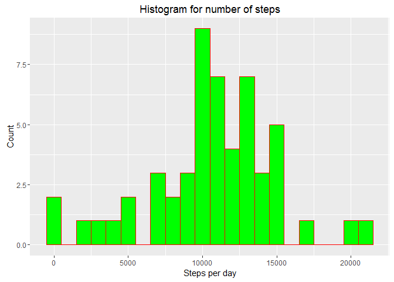
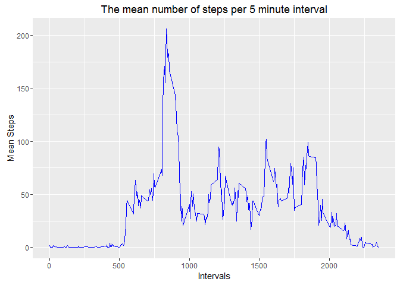
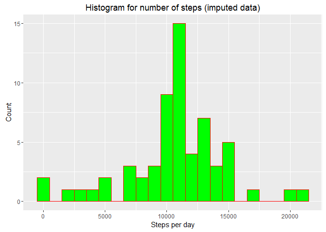
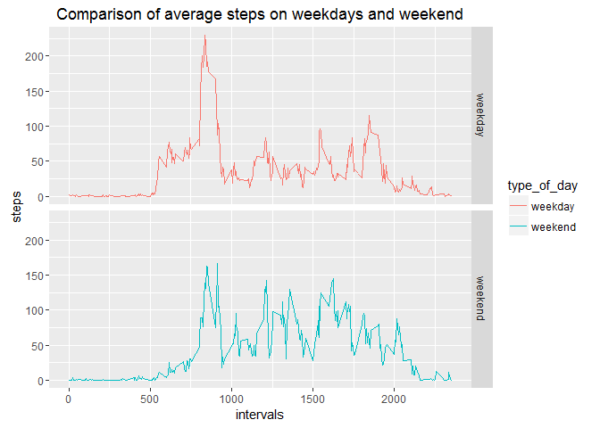

# Reproducible Research: Peer Assessment 1
## Introduction
This assignment makes use of data from a personal activity monitoring device. This device collects data at 5 minute intervals through out the day. The data consists of two months of data from an anonymous individual collected during the months of October and November, 2012 and include the number of steps taken in 5 minute intervals each day.

The following libraries will be required to do the anaysis:


```r
library(ggplot2)
library(doBy)
library(lubridate)
library(dplyr)
```

## Loading and preprocessing the data
The zip file for the data should be downloaded to the working directory and renamed to **"activity.zip"**
The activity data is unzipped and read in the following manner.

```r
activity_data <- read.csv(unzip("activity.zip"))
```
The data is then transformed into a suitable form for the first part of the analysis using the "doBy" package.
For this part the data is summed for each day using the function summaryBy.

```r
ad_byDate <- summaryBy(steps~date, data = activity_data, FUN = sum)
```

## What is mean total number of steps taken per day?
A histogram of the total number of steps taken each day is made using ggplot.

```r
ggplot(data=ad_byDate,
        aes(ad_byDate$steps.sum)) + 
        geom_histogram(col = "red",fill = "green",binwidth = 1000) + 
        labs(title = "Histogram for number of steps") + 
        labs(x="Steps per day", y = "Count")
```

<!-- -->

Calculate and report the mean and median total number of steps taken per day.

```r
steps_mean <- mean(ad_byDate$steps.sum,na.rm = TRUE)
steps_median <- median(ad_byDate$steps.sum,na.rm = TRUE)
```

```r
steps_mean
```

```
## [1] 10766.19
```

```r
steps_median
```

```
## [1] 10765
```
## What is the average daily activity pattern?
Make a time series plot of the 5 minute interval (x -axis) and the average number of steps taken averaged accross all days (y-axis).
To do this we first have to calculate the mean number of steps per interval. This is done using the "aggregate" function.

```r
steps_mean_interval <- aggregate(activity_data$steps,by=list(activity_data$interval),mean, na.rm = TRUE)
colnames(steps_mean_interval) <- c("interval","average_steps")
```
The plot for making the time series was created using ggplot.

```r
ggplot(steps_mean_interval,aes(x=interval,y=average_steps)) + 
        geom_line(col="blue") + 
        labs(x="Intervals",y="Mean Steps",
             title = "The mean number of steps per 5 minute interval")
```

<!-- -->

The interval with the largest amount of steps can be determined in the following way.

```r
steps_mean_interval[which.max(steps_mean_interval$average_steps),]
```

```
##     interval average_steps
## 104      835      206.1698
```
## Imputing missing values
First the total number of missing values is determined.

```r
sum(is.na(activity_data$steps))
```

```
## [1] 2304
```
A new activity dataset is created by imputing the original dataset with the mean of the steps taken per interval.

```r
activity_data_impute <- activity_data %>% 
        group_by(interval) %>% 
        mutate(Mean = mean(steps,na.rm=TRUE),
               steps = replace(steps,which(is.na(steps)),first(Mean))) %>% 
        select(-Mean)
activity_data_impute <- data.frame(activity_data_impute)
```
The original dataset had missing values for the first day.

```r
head(activity_data)
```

```
##   steps       date interval
## 1    NA 2012-10-01        0
## 2    NA 2012-10-01        5
## 3    NA 2012-10-01       10
## 4    NA 2012-10-01       15
## 5    NA 2012-10-01       20
## 6    NA 2012-10-01       25
```
This has now been imputed with the interval average values.

```r
head(activity_data_impute)
```

```
##       steps       date interval
## 1 1.7169811 2012-10-01        0
## 2 0.3396226 2012-10-01        5
## 3 0.1320755 2012-10-01       10
## 4 0.1509434 2012-10-01       15
## 5 0.0754717 2012-10-01       20
## 6 2.0943396 2012-10-01       25
```
The totals are taken for each day.

```r
adi_byDate <- summaryBy(steps~date, data = activity_data_impute, FUN = sum)
```
And the results of the imputed data are plotted using ggplot as we did before.

```r
ggplot(data=adi_byDate,
            aes(adi_byDate$steps.sum)) + 
        geom_histogram(col = "red",fill = "green",binwidth = 1000) + 
        labs(title = "Histogram for number of steps (imputed data)") + 
        labs(x="Steps per day", y = "Count")
```

<!-- -->

The mean and median of the total number of steps taken per day with the imputed data is now.

```r
steps_mean_impute <- mean(adi_byDate$steps.sum,na.rm = TRUE)
steps_median_impute <- median(adi_byDate$steps.sum,na.rm = TRUE)
```

```r
steps_mean_impute
```

```
## [1] 10766.19
```

```r
steps_median_impute
```

```
## [1] 10766.19
```
We can see that the imputation resulted in the median being now equal to the mean.  

## Are there differences in activity patterns between weekdays and weekends?
For this part the "weekdays" function is used to determine the day and the imputed dataset gets an additional column that indicates the "type_of_day" i.e. weekday or weekend.

```r
activity_data_impute$date <- ymd(activity_data_impute$date)
activity_data_full <- mutate(activity_data_impute, 
type_of_day = ifelse(weekdays(activity_data_impute$date) == "Saturday" | weekdays(activity_data_impute$date) == "Sunday", "weekend", "weekday"))

activity_data_full$type_of_day <- as.factor(activity_data_full$type_of_day)
```
This is what the full data now looks like.

```r
head(activity_data_full)
```

```
##       steps       date interval type_of_day
## 1 1.7169811 2012-10-01        0     weekday
## 2 0.3396226 2012-10-01        5     weekday
## 3 0.1320755 2012-10-01       10     weekday
## 4 0.1509434 2012-10-01       15     weekday
## 5 0.0754717 2012-10-01       20     weekday
## 6 2.0943396 2012-10-01       25     weekday
```
Finally we shall make a a panel plot containing a time series plot of the 5 minute interval and the average number of steps taken, averaged accross all weekdays or weekend days(y-axis).

```r
steps_mean_interval_day <- 
        aggregate(activity_data_full$steps,
                  by=list(activity_data_full$interval,
                          activity_data_full$type_of_day),mean, na.rm = TRUE)

colnames(steps_mean_interval_day) <- c("interval","type_of_day","mean_steps")

ggplot(steps_mean_interval_day,
             aes(x=interval,y=mean_steps,color=type_of_day)) + 
        geom_line() + 
        facet_grid(type_of_day~.) + 
        labs(x="intervals",y="steps",
             title = "Comparison of average steps on weekdays and weekend")
```

<!-- -->

It seems that the morning activity is greater during the week than on weekends. However during the day the actvity is greater on the weekends.
